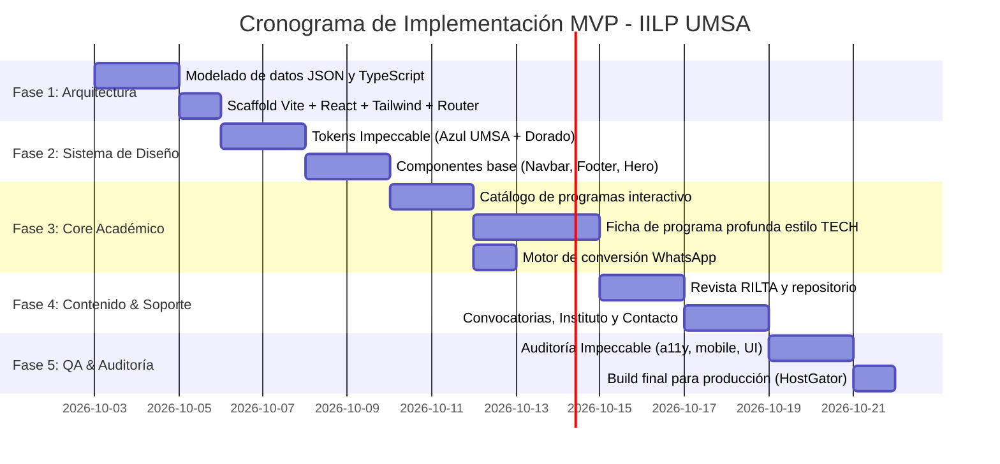

# Plan de Implementación del Portal Web del IILP — UMSA (MVP Completo)

> **Versión:** 2.0 (MVP Ágil Basado en Datos JSON y Alta Conversión)  
> **Institución:** Instituto de Investigaciones Lingüísticas y Postgrado (IILP) — Universidad Mayor de San Andrés (UMSA)  
> **Dirección Visual:** Híbrido especializado de **TECH Universidad Tecnológica** (60%) y **Posgrado UPEA** (40%), adaptado con la identidad académica y cultural del IILP-UMSA y auditado con la skill **Impeccable**.

---

## 1. Resumen Ejecutivo y Enfoque del MVP

El objetivo de esta actualización es implementar un **portal web de postgrado de nivel de producción**, con experiencia completa de cara al usuario ("MVP Completo"), pero **sin la sobrecarga de un panel de administración ni backend complejo en esta primera fase**.

Para lograr un lanzamiento ágil y de máxima calidad:
1. **Datos JSON estructurados como Base de Datos:** Toda la información académica (programas, módulos, docentes, convocatorias, publicaciones RILTA e información institucional) se gestiona mediante esquemas JSON fuertemente tipados en TypeScript. Estos archivos replican exactamente la estructura de tablas relacionales (claves primarias, foráneas e índices), de modo que en la siguiente fase puedan importarse directamente a **MySQL, PostgreSQL o Supabase** sin modificar la interfaz.
2. **Sin administrador en Fase 1:** Se elimina el desarrollo de autenticación, roles, sesiones y formularios CRUD de gestión. La actualización de datos se realiza de forma directa y segura en los archivos JSON del repositorio.
3. **Canal de Conversión 100% WhatsApp Contextual:** Se adopta el patrón de mayor efectividad comercial y académica en Bolivia (estilo Posgrado UPEA), donde cada programa, botón y ficha genera un enlace dinámico a WhatsApp con un mensaje preconfigurado que indica el programa específico, la versión y la solicitud del postulante.
4. **Ficha de Programa con Profundidad TECH:** Cada programa de postgrado cuenta con una página individual exhaustiva inspirada en TECH Universidad Tecnológica: hero de autoridad, ficha rápida de datos (créditos, horas, modalidad, inversión), desglose modular del plan de estudios con acordeones, claustro docente con grados y biografías, perfil de egreso, requisitos y barra de conversión lateral/persistente.

---

## 2. Inspiración Visual y Referencias de Producción

### 2.1. El Patrón TECH Universidad Tecnológica (60% de la Experiencia)
*Referencia:* [TECH Universidad — Máster Oficial](https://www.techtitute.com/es-es/educacion/master-oficial-universitario/formacion-del-profesorado-de-educacion-secundaria-obligatoria-y-bachillerato-formacion-profesional-y-ensenanza-de-idiomas-especialidad-en-economia-y-empresa)

- **Landing de Programa de Gran Profundidad:** No un simple resumen, sino una página académica completa que despeja todas las dudas del postulante.
- **Ficha Rápida (Fast Facts):** Grilla superior con iconografía limpia que resume: Duración (meses), Créditos (ECTS / Horas académicas), Modalidad (100% Virtual / Semipresencial), Título oficial otorgado y Fecha de inicio.
- **Estructura Modular del Plan de Estudios:** Presentación clara del temario mediante módulos desplegables, objetivos formativos y competencias.
- **Claustro Docente de Prestigio:** Tarjetas individuales con fotografía profesional, grado académico (Dr., M.Sc.), especialidad e institución de procedencia.
- **Barra de Conversión Persistente:** En escritorio, tarjeta lateral flotante con precio, facilidades de pago y CTA; en móvil, barra inferior fija no invasiva.

### 2.2. El Patrón Posgrado UPEA (40% de la Experiencia)
*Referencia:* [Posgrado UPEA — Portal Oficial de Programas](https://programas.posgradoupea.edu.bo/)

- **Franja Institucional Superior:** Barra superior con jerarquía UMSA, Facultad de Humanidades y Ciencias de la Educación, Carrera de Lingüística e IILP.
- **Catálogo Dinámico por Categorías:** Filtros inmediatos mediante pestañas para: **Todos, Doctorados, Maestrías, Especialidades, Diplomados y Cursos**.
- **Chips de Estado de Convocatoria:** Etiquetas visuales de alta visibilidad: `"Inscripciones Abiertas"`, `"Inicio Inminente"`, `"Próximamente"`.
- **Botón de WhatsApp Directo con Mensaje Contextual:** Botones de llamada a la acción directos que abren la aplicación de WhatsApp con texto estructurado para el equipo de admisiones.
- **Cercanía Cultural y Universitaria:** Identidad visual representativa del sistema universitario público boliviano, destacando solvencia institucional y accesibilidad.

### 2.3. Principios de Artesanía Impecable (Impeccable Craft)
Conforme a las directrices de la skill `impeccable`:
- **Modo Persuade para Programas:** Jerarquía visual estricta, tipografía con ritmo armónico, contraste accesible (WCAG AAA en textos críticos) y eliminación de enlaces provisionales (`#`).
- **Paleta de Identidad UMSA-IILP:**
  - Azul Institucional Primario: `#0F4794`
  - Azul Noche Profundo (Header/Footer): `#082E54`
  - Dorado de Excelencia Académica (Acentos y CTAs clave): `#F4B63D`
  - Borgoña de Alerta/Convocatoria: `#9E1B46`
  - Fondo Neutral Limpio: `#F8FAFC`
  - Texto Principal: `#0F172A`
- **Rendimiento Extremo:** Cero dependencias pesadas innecesarias; animaciones sutiles con CSS y transiciones de estado instantáneas.

---

## 3. Arquitectura Técnica del MVP

### 3.1. Stack Tecnológico
| Capa | Tecnología | Justificación |
|---|---|---|
| **Frontend Framework** | **React 18 / 19 + Vite** | Carga ultra rápida, compilación instantánea y arquitectura basada en componentes reutilizables. |
| **Lenguaje** | **TypeScript** | Modelado estricto de los datos académicos; previene errores de propiedades en componentes y garantiza consistencia con la futura BD. |
| **Estilos & UI** | **Tailwind CSS** | Sistema de diseño tokenizado, responsive nativo, utilidades consistentes y peso mínimo en producción. |
| **Iconografía** | **Lucide React** | Iconos vectoriales limpios y modernos acordes al estilo TECH y UPEA. |
| **Enrutamiento** | **React Router (SPA)** | Navegación instantánea entre páginas de catálogo, detalle de programa, publicaciones e información institucional. |
| **Capa de Datos** | **JSON Relacional Local** | Archivos JSON en `/src/data/` que funcionan como base de datos local desacoplada. |
| **Despliegue** | **Estático (Vite Build)** | Los archivos compilados (`dist/`) pueden desplegarse en cualquier hosting cPanel (como HostGator en `public_html`), Vercel o GitHub Pages con costo operativo cero. |

### 3.2. Estructura de Directorios del Proyecto
```
c:/Users/XAVI/Documents/PROYECTOS 2026/IILP/
├── .agent/skills/impeccable/     # Skill de diseño instalada y activa
├── .impeccable/config.json       # Configuración Impeccable (buildPath: code)
├── PRODUCT.md                    # Verdad duradera del producto
├── Plan_Implementacion_Web_IILP.md # Este documento de planificación
├── public/
│   ├── images/
│   │   ├── hero/                 # Fotografías del hero institucional
│   │   ├── programs/             # Portadas y banners de postgrados
│   │   ├── faculty/              # Fotografías de docentes e investigadores
│   │   ├── publications/         # Portadas de la Revista RILTA y libros
│   │   └── logos/                # UMSA, Facultad de Humanidades, IILP
│   └── docs/                     # Convocatorias oficiales y brochures en PDF
├── src/
│   ├── components/
│   │   ├── layout/               # Header, Footer, TopBar institucional
│   │   ├── home/                 # Hero, StatsCounter, FeaturedPrograms, RiltaShowcase
│   │   ├── catalog/              # ProgramCard, FilterTabs, SearchBar
│   │   ├── program/              # ProgramHero, FastFacts, SyllabusAccordion, FacultyGrid, StickyCTA
│   │   ├── common/               # WhatsAppFloat, Badge, Modal, Breadcrumb
│   │   └── ui/                   # Button, Card, Tabs, Accordion (estilo Impeccable)
│   ├── data/                     # BASE DE DATOS JSON NORMALIZADA
│   │   ├── programs.json         # Catálogo maestro de postgrados
│   │   ├── modules.json          # Módulos y temarios por programa
│   │   ├── faculty.json          # Claustro docente e investigadores
│   │   ├── calls.json            # Convocatorias institucionales
│   │   ├── publications.json     # Revista RILTA y publicaciones científicas
│   │   └── institute.json        # Datos institucionales, líneas de inv., contacto
│   ├── types/                    # Definiciones TypeScript de entidades relacionales
│   │   └── database.types.ts     # Interfaces 1:1 listas para MySQL/Supabase
│   ├── utils/
│   │   ├── whatsapp.ts           # Generador de enlaces dinámicos con mensajes
│   │   └── formatters.ts         # Formato de moneda (Bs.), fechas y duraciones
│   ├── App.tsx                   # Rutas y layout principal
│   ├── main.tsx                  # Punto de entrada
│   └── index.css                 # Tokens CSS e importación de fuentes
└── package.json
```

---

## 4. Arquitectura de Datos JSON (Lista para Base de Datos)

Los modelos están diseñados para reflejar tablas SQL relacionales con claves foráneas, facilitando la exportación posterior a MySQL o PostgreSQL mediante scripts de seeding.

### 4.1. Esquema de Entidades (`database.types.ts`)

```typescript
// Programas de Postgrado (Tabla: programs)
export interface Program {
  id: string; // p. ej. "prog-mae-ling-01"
  slug: string; // "maestria-linguistica-teorica-aplicada"
  type: 'maestria' | 'diplomado' | 'doctorado' | 'especialidad' | 'curso';
  title: string;
  subtitle: string;
  version: string; // p. ej. "Versión V"
  degree_awarded: string; // "Magíster Scientiarum en..."
  modality: 'Virtual' | 'Semipresencial' | 'Presencial';
  duration_months: number;
  academic_hours: number;
  credits_ects?: number;
  investment_bob: number;
  registration_fee_bob: number;
  installments_count: number;
  start_date: string; // "2026-05-15"
  schedule: string; // "Lunes y Miércoles 19:00 - 22:00"
  status: 'open' | 'imminent' | 'upcoming' | 'closed';
  is_featured: boolean;
  cover_image: string;
  banner_image: string;
  brochure_pdf_url: string;
  summary: string;
  general_objective: string;
  specific_objectives: string[];
  applicant_profile: string[];
  graduate_profile: string[];
  target_audience: string[];
  requirements: string[];
  contact_whatsapp: string; // Número de atención específico
}

// Módulos del Plan de Estudios (Tabla: program_modules)
export interface Module {
  id: string;
  program_id: string; // FK -> Program.id
  module_number: number;
  code: string;
  title: string;
  description: string;
  hours: number;
  credits?: number;
  topics: string[];
}

// Docentes y Claustro Académico (Tabla: faculty)
export interface Faculty {
  id: string;
  full_name: string;
  academic_degree: string; // "Doctor en Lingüística Teórica"
  degree_abbrev: string; // "Dr." | "M.Sc." | "Lic."
  role_title: string; // "Docente Principal / Investigador Titular"
  bio: string;
  specialty: string;
  photo_url: string;
  orcid?: string;
  country: string;
}

// Relación Programa-Docente (Tabla: program_faculty)
export interface ProgramFacultyRelation {
  program_id: string; // FK -> Program.id
  faculty_id: string; // FK -> Faculty.id
  role_in_program: string; // "Coordinador Académico" | "Docente de Módulo"
  order_display: number;
}

// Revista RILTA y Publicaciones (Tabla: publications)
export interface Publication {
  id: string;
  type: 'rilta' | 'libro' | 'cuaderno_investigacion';
  journal_name: string;
  volume: number;
  issue: number;
  year: number;
  title: string;
  authors: string[];
  abstract: string;
  cover_image: string;
  pdf_url: string; // Enlace a descarga real o repositorio OJS
  ojs_url?: string;
  doi?: string;
}

// Convocatorias y Eventos (Tabla: announcements)
export interface Announcement {
  id: string;
  category: 'convocatoria_docente' | 'convocatoria_estudiantes' | 'evento_academico' | 'noticia';
  title: string;
  slug: string;
  published_date: string;
  closing_date?: string;
  status: 'vigente' | 'cerrada';
  location: string;
  summary: string;
  content: string;
  image_url: string;
  document_pdf_url?: string;
  action_label?: string;
  action_url?: string;
}

// Configuración Institucional (Tabla: institute_settings)
export interface InstituteInfo {
  name: string;
  acronym: string;
  university: string;
  faculty: string;
  address: string;
  phone: string;
  email: string;
  main_whatsapp: string;
  office_hours: string;
  social_links: {
    facebook: string;
    youtube?: string;
    whatsapp_channel?: string;
  };
  mission: string;
  vision: string;
  research_lines: {
    id: string;
    title: string;
    description: string;
    icon: string;
  }[];
  authorities: {
    name: string;
    position: string;
    photo_url: string;
  }[];
}
```

---

## 5. El Motor de Conversión WhatsApp (Inspiración Posgrado UPEA)

En lugar de formularios estáticos que requieren base de datos y administrador para su lectura, el MVP implementa una utilidad que genera enlaces dinámicos con formato profesional:

```typescript
// src/utils/whatsapp.ts
export function buildWhatsAppLink(programTitle: string, version: string, phone: string = "59163240879"): string {
  const message = `¡Hola! Vengo desde el portal web oficial del IILP - UMSA.\n\n` +
    `Estoy interesado(a) en recabar información detallada, requisitos y facilidades de pago para:\n` +
    `📌 *${programTitle}* (${version})\n\n` +
    `Agradezco me puedan orientar con el proceso de preinscripción.`;
  
  return `https://wa.me/${phone.replace(/[^0-9]/g, '')}?text=${encodeURIComponent(message)}`;
}
```

**Ventajas operativas:**
- El postulante recibe respuesta inmediata por el personal de postgrado del IILP en su teléfono.
- Cero pérdidas de prospectos en bases de datos desatendidas.
- Trazabilidad: cada mensaje indica con exactitud qué programa consultó el usuario.

---

## 6. Estructura de las Páginas del MVP

### 6.1. Página de Inicio (Home)
1. **Franja Superior UMSA (Estilo UPEA):** Enlaces directos a UMSA, Facultad de Humanidades, teléfono y botón rápido de WhatsApp.
2. **Navegación Limpia (Estilo TECH):** Logo del IILP, enlaces a "Programas", "Investigación", "Revista RILTA", "Convocatorias" y botón de acción destacado.
3. **Hero Híbrido:**
   - Título impactante con tipografía de calidad superior: *Postgrados e Investigación Lingüística de Referencia Nacional*.
   - Presentación del Máster o Programa prioritario con fecha de inicio y modalidad.
   - Dos CTA claros: `[Ver Oferta Académica]` y `[Consultar por WhatsApp]`.
4. **Cifras de Respaldo Académico:** Indicadores animados de años de trayectoria, docentes con grado doctoral, publicaciones en RILTA y estudiantes formados.
5. **Programas Destacados (Catálogo Preview):** Tarjetas con chips de estado (`Inscripciones Abiertas`), versión, modalidad, duración y botón directo a la ficha completa.
6. **Líneas de Investigación Científica:** Foco en lenguas originarias (Aymara, Quechua, Tsimane, etc.), sociolingüística y lingüística aplicada.
7. **Vitrina de Revista RILTA:** Presentación del último volumen con resumen y acceso directo a lectura.
8. **Convocatorias y Noticias Recientes:** Filtro de vigencia para evitar anuncios caducados.
9. **Footer Institucional:** Datos de contacto, ubicación física en La Paz, horarios y acreditaciones.

### 6.2. Catálogo de Postgrados (`/programas`)
- **Pestañas de Filtrado Dinámico:** `Todos`, `Doctorados`, `Maestrías`, `Especialidades`, `Diplomados`.
- **Buscador en Tiempo Real:** Búsqueda instantánea por palabras clave en título, descripción o modalidad.
- **Tarjetas de Programa de Alto Impacto:**
  - Imagen representativa y badge de estado.
  - Título, subtítulo y versión.
  - Grilla de datos clave: Duración, Modalidad, Inicio.
  - Acciones: Botón principal `[Ver Programa Completo]` y botón secundario `[WhatsApp WhatsApp]`.

### 6.3. Ficha Extensa de Programa (`/programas/:slug`) — El Núcleo TECH
- **Hero de Programa:**
  - Título formal y titulación expedida por la UMSA.
  - Badge de versión y estado de postulación.
- **Ficha Rápida (Fast Facts Bar):**
  - Modalidad (100% Virtual / Semipresencial).
  - Duración y Carga Horaria (Horas académicas y créditos).
  - Inversión y plan de cuotas (en Bolivianos Bs.).
  - Fecha de Inicio y Horarios de clases.
- **Barra Lateral / Flotante de Conversión:**
  - Inversión visible con opciones de pago.
  - Botón principal de WhatsApp: `[Preinscribirme por WhatsApp]`.
  - Botón secundario: `[Descargar Brochure / Convocatoria PDF]`.
- **Secciones Académicas Detalladas (Navegación por Scroll/Tabs):**
  1. *Presentación y Enfoque del Programa.*
  2. *Objetivos Formativos y Competencias.*
  3. *Perfil del Postulante y de Egreso.*
  4. *Plan de Estudios Modular (Acordeón con temas y créditos de cada módulo).*
  5. *Claustro Docente (Fotografía, grado académico y trayectoria).*
  6. *Requisitos de Admisión y Documentación Solicitada.*
  7. *Inversión, Descuentos Institucionales y Cronograma.*

### 6.4. Sección de Investigación y Revista RILTA (`/rilta`)
- Catálogo de volúmenes de la Revista de Investigaciones Lingüísticas y Teoría Aplicada (RILTA).
- Ficha por número con tabla de contenidos, autores y enlace directo a los PDFs alojados localmente o al portal OJS.
- Información sobre el comité editorial y normas para autores.

### 6.5. Convocatorias y Eventos (`/convocatorias`)
- Convocatorias docentes y estudiantiles activas.
- Descarga directa de bases y formularios en PDF.
- Distinción visual inequívoca entre convocatorias vigentes y convocatorias concluidas.

### 6.6. Contacto e Información Institucional (`/contacto`, `/instituto`)
- Misión, visión, historia y autoridades del IILP.
- Mapa interactivo de ubicación (Predios UMSA / Casa Marcelo Quiroga Santa Cruz / Monoblock).
- Horarios de atención y canales oficiales.

---

## 7. Fases de Implementación del Plan



### Detalle de las Fases:

### **Fase 1: Arquitectura de Datos y Scaffold Base** `[COMPLETADA ✅]`
- **Objetivo:** Establecer la base técnica y el conjunto de datos estructurados.
- **Entregables Implementados:**
  - Proyecto inicializado con `Vite + React + TypeScript + Tailwind CSS + Lucide Icons`.
  - Archivo `src/types/database.types.ts` con todos los modelos relacionales fuertemente tipados.
  - Conjunto de datos JSON relacionales en `src/data/`: `programs.json`, `modules.json`, `faculty.json`, `program_faculty.json`, `publications.json`, `calls.json`, `institute.json`.

### **Fase 2: Sistema de Diseño Impeccable & Layout Institucional** `[COMPLETADA ✅]`
- **Objetivo:** Crear la identidad visual de alta jerarquía combinando TECH y UPEA.
- **Entregables Implementados:**
  - Tokens Impeccable configurados en Tailwind (Azul UMSA `#0F4794`, Azul noche `#082E54`, Dorado `#F4B63D`, Borgoña `#9E1B46`).
  - Barra superior institucional (UPEA style) con logotipos de la UMSA y Facultad.
  - Header de navegación con menú responsive y botón de contacto.
  - Footer corporativo con datos de contacto, enlaces y respaldo institucional.
  - Botón flotante persistente de WhatsApp con mensaje contextual.

### **Fase 3: Desarrollo del Catálogo y la Ficha de Programa (El Core del Negocio)** `[COMPLETADA ✅]`
- **Objetivo:** Proporcionar la experiencia de información y conversión de postgrados.
- **Entregables Implementados:**
  - **Página de Catálogo (`/programas`):** Buscador reactivo y pestañas de filtrado (Maestrías, Diplomados, Especialidades, Doctorados).
  - **Tarjetas de Programa:** Chips de estado (`Inscripciones Abiertas`, `Inicio Inminente`), duración, carga horaria y doble CTA.
  - **Ficha Extensa de Programa (`/programas/:slug` — Inspiración TECH):**
    - Hero con credenciales de titulación UMSA.
    - FastFacts con métricas académicas (horas, créditos, modalidad, cuotas).
    - Acordeón de asignaturas/módulos con temario y competencias.
    - Claustro docente con tarjetas individuales y grados académicos.
    - Bloque de inversión y calendario de pagos.
    - Tarjeta lateral de conversión fija al hacer scroll (StickyCTA) y barra móvil persistente.

### **Fase 4: Secciones Institucionales, RILTA y Convocatorias** `[COMPLETADA ✅]`
- **Objetivo:** Completar el ecosistema informativo del IILP.
- **Entregables Implementados:**
  - **Portada Principal (`/`):** Hero de bienvenida, cifras clave, programas destacados, líneas de investigación científica, vitrina de Revista RILTA y llamados a la acción.
  - **Portal Revista RILTA (`/rilta`):** Catálogo de volúmenes 10, 9 y 6 con resúmenes bilingües (Español/English), enlaces a OJS UMSA, descarga de PDFs y normas para autores.
  - **Sección de Convocatorias (`/convocatorias`):** Filtros por categoría (Admisiones, Docentes, Eventos), control de solo vigentes, tarjetas informativas y modal de lectura completa.
  - **Página Institucional y Contacto (`/contacto`, `/instituto`):** Misión, visión, objetivos, autoridades, líneas de investigación, formulario contextual conectado a WhatsApp y mapa interactivo de Google Maps (Casa Marcelo Quiroga Santa Cruz).

### **Fase 5: Auditoría con Skill Impeccable, Calidad y Optimización** `[COMPLETADA ✅]`
- **Objetivo:** Asegurar que el diseño sea sobresaliente, accesible y rápido.
- **Entregables Implementados:**
  - Auditoría mecánica Impeccable ejecutada sin defectos (`[]` 0 errores en todos los componentes y páginas).
  - Cero enlaces provisionales rotos (`#`). Todos los botones y links conducen a rutas, acciones o documentos reales.
  - Contraste estricto WCAG y tipografías legibles.
  - Diseño 100% responsivo para móviles, tablets y pantallas de escritorio.

### **Fase 6: Despliegue del MVP y Preparación para Fase 2 (BD & Admin)** `[COMPLETADA ✅]`
- **Objetivo:** Poner el sitio en producción y documentar la hoja de ruta a futuro.
- **Entregables Implementados:**
  - Compilación de producción exitosa (`npm run build`) en la carpeta `dist/`.
  - Configuración de enrutamiento SPA para servidores Apache/cPanel en `dist/.htaccess` y `public/.htaccess`.
  - Archivo `public/robots.txt` para indexación en motores de búsqueda.
  - Script SQL relacional completo y seed data en `scripts/schema_and_seed.sql` listo para importar en Supabase, PostgreSQL o MySQL.
  - Guía detallada de mantenimiento y despliegue en `GUIA_MANTENIMIENTO_Y_DESPLIEGUE.md`.

---

## 8. Criterios de Aceptación del MVP

1. **Navegación Fluida:** El usuario puede navegar de la portada al catálogo, filtrar programas y acceder a cualquier ficha en menos de 1 segundo sin recargas bruscas.
2. **Experiencia Móvil de Primer Nivel:** Más del 70% de los usuarios de postgrado en Bolivia navegan desde smartphones; el menú, las fichas y el botón de WhatsApp deben sentirse nativos y cómodos.
3. **Conversión Efectiva:** Cada botón de consulta en un programa abre WhatsApp en el dispositivo con el nombre exacto de la maestría o diplomado consultado.
4. **Datos Coherentes y Realistas:** Todos los programas, costos en Bolivianos (Bs.), modalidades y requisitos corresponden fielmente a los estándares del IILP y la normativa de postgrado de la UMSA.
5. **Arquitectura Limpia:** El código de componentes está desacoplado de la fuente de datos; migrar de `programs.json` a una API REST futura requerirá únicamente sustituir la función de carga por un `fetch()`.
